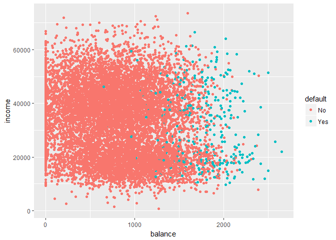

We will use Default data set from ISLR package. The aim here is to
predict which customers will default based on their credit card debt.

    library(ISLR)
    head(Default)

    ##   default student   balance    income
    ## 1      No      No  729.5265 44361.625
    ## 2      No     Yes  817.1804 12106.135
    ## 3      No      No 1073.5492 31767.139
    ## 4      No      No  529.2506 35704.494
    ## 5      No      No  785.6559 38463.496
    ## 6      No     Yes  919.5885  7491.559

    library(ggplot2)
    g<-ggplot(Default,aes(balance,income,color=default))
    g+geom_point()

Now we will divide the dataset into two, one training and one test. And
then fit a linear model on the training data using income and balance,
obtain a prediction of default status for each individual in the test
data and finally compute the validation set error

    dim(Default)

    ## [1] 10000     4

    set.seed(1)
    train<-sample(10000,5000)
    glm.fit1<-glm(default~balance+income,data=Default[train,],family=binomial)
    glm.prob<-predict(glm.fit1,Default[-train,],type="response")
    glm.pred<-rep("No",5000)
    glm.pred[glm.prob>=0.5]<-"Yes"
    table(glm.pred,Default$default[-train])

    ##         
    ## glm.pred   No  Yes
    ##      No  4805  115
    ##      Yes   28   52

    mean(glm.pred!=Default$default[-train])

    ## [1] 0.0286

Now the same process will be repeated including the dummy variable
student in the logistic regression model

    glm.fit2<-glm(default~balance+income+student,data=Default[train,],family=binomial)
    glm.prob2<-predict(glm.fit2,Default[-train,],type="response")
    glm.pred2<-rep("No",5000)
    glm.pred2[glm.prob2>=0.5]<-"Yes"
    table(glm.pred2,Default$default[-train])

    ##          
    ## glm.pred2   No  Yes
    ##       No  4803  114
    ##       Yes   30   53

    mean(glm.pred2!=Default$default[-train])

    ## [1] 0.0288

There is not much improvement in the test error by including dummy
variable in the model

Now we will compute estimates for the standard errors of the income and
balance logistic regression coeffients in two different ways (1)
bootstrap and (2)the standard formula in glm

    set.seed(1)
    #train<-sample(10000,5000)
    glm.fit1<-glm(default~balance+income,data=Default,family=binomial)
    summary(glm.fit1)$coef

    ##                  Estimate   Std. Error    z value      Pr(>|z|)
    ## (Intercept) -1.154047e+01 4.347564e-01 -26.544680 2.958355e-155
    ## balance      5.647103e-03 2.273731e-04  24.836280 3.638120e-136
    ## income       2.080898e-05 4.985167e-06   4.174178  2.990638e-05

    boot.fn<-function(data2,index){
      c<-glm(default~income+balance,data=data2,subset=index,family=binomial)
      coef(c)
    }
    library(boot)
    boot(Default,boot.fn,R=1000)

    ## 
    ## ORDINARY NONPARAMETRIC BOOTSTRAP
    ## 
    ## 
    ## Call:
    ## boot(data = Default, statistic = boot.fn, R = 1000)
    ## 
    ## 
    ## Bootstrap Statistics :
    ##          original        bias     std. error
    ## t1* -1.154047e+01 -8.008379e-03 4.239273e-01
    ## t2*  2.080898e-05  5.870933e-08 4.582525e-06
    ## t3*  5.647103e-03  2.299970e-06 2.267955e-04
