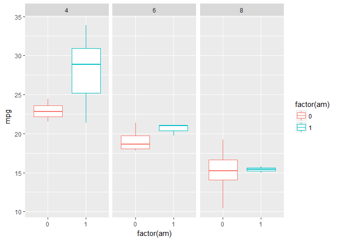
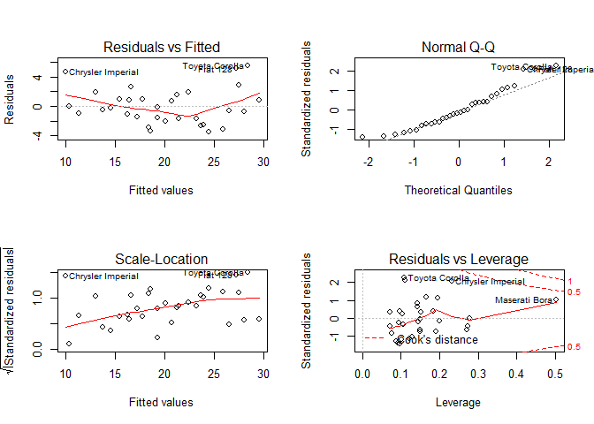

Excecutive summary
------------------

1.  manual transmission better for MPG
2.  the difference between automatic and manual transmission is 2.16 MPG

### First question

First regression model will discard all the variables and show the
relationship between mpg and am only

    fit1<-lm(mpg~factor(am),mtcars)
    summary(fit1)$coef

    ##              Estimate Std. Error   t value     Pr(>|t|)
    ## (Intercept) 17.147368   1.124603 15.247492 1.133983e-15
    ## factor(am)1  7.244939   1.764422  4.106127 2.850207e-04

This shows the average mpg of manual transmission cars are higher than
that of automatic transmission cars. Now, this will be verified by
introducing other variables of the dataset in the model one at a time

    fit2<-lm(mpg~factor(am) + disp,mtcars)
    fit3<-lm(mpg~factor(am) + disp + hp,mtcars)
    fit4<-lm(mpg~factor(am) + disp + hp + wt,mtcars)
    fit5<-lm(mpg~factor(am) + disp + hp + wt + qsec,mtcars)
    fit6<-lm(mpg~factor(am) + disp + hp + wt + qsec + drat,mtcars)
    fit7<-lm(mpg~factor(am) + disp + hp + wt + qsec + drat + factor(cyl) + factor(vs) + factor(gear),mtcars)
    cf <- c(coef(fit1)[1],coef(fit2)[1],coef(fit3)[1],coef(fit4)[1],coef(fit5)[1],coef(fit6)[1],coef(fit7)[1])
    cf2 <- c(coef(fit1)[2],coef(fit2)[2],coef(fit3)[2],coef(fit4)[2],coef(fit5)[2],coef(fit6)[2],coef(fit7)[2])
    cf

    ## (Intercept) (Intercept) (Intercept) (Intercept) (Intercept) (Intercept) 
    ##    17.14737    27.84808    27.86623    34.20944    14.36190    10.71062 
    ## (Intercept) 
    ##    16.04441

    cf2

    ## factor(am)1 factor(am)1 factor(am)1 factor(am)1 factor(am)1 factor(am)1 
    ##    7.244939    1.833458    3.796227    2.159271    3.470453    2.984688 
    ## factor(am)1 
    ##    2.936464

Based on these coefficients of the multivariable linear models, it is
evident that average mpg of manual tranmission is always higher than
that of automatic tranmission cars regardless of which variable or
variables are kept fixed.**Clearly manual transmission better for MPG
based on this dataset**

### Second question

The average mpg of manual transmission cars compared to that of
automatic transmission cars changes with variables in the model as shown
in the last section. Now to qunatify the average mpg improvement ANOVA
can be used with the models desribed in the last section

    anova(fit1,fit2,fit3,fit4,fit5,fit6,fit7)

    ## Analysis of Variance Table
    ## 
    ## Model 1: mpg ~ factor(am)
    ## Model 2: mpg ~ factor(am) + disp
    ## Model 3: mpg ~ factor(am) + disp + hp
    ## Model 4: mpg ~ factor(am) + disp + hp + wt
    ## Model 5: mpg ~ factor(am) + disp + hp + wt + qsec
    ## Model 6: mpg ~ factor(am) + disp + hp + wt + qsec + drat
    ## Model 7: mpg ~ factor(am) + disp + hp + wt + qsec + drat + factor(cyl) + 
    ##     factor(vs) + factor(gear)
    ##   Res.Df    RSS Df Sum of Sq       F    Pr(>F)    
    ## 1     30 720.90                                   
    ## 2     29 300.28  1    420.62 62.7777 1.352e-07 ***
    ## 3     28 226.10  1     74.18 11.0712  0.003359 ** 
    ## 4     27 179.91  1     46.20  6.8948  0.016196 *  
    ## 5     26 153.44  1     26.47  3.9507  0.060718 .  
    ## 6     25 150.09  1      3.34  0.4992  0.488010    
    ## 7     20 134.00  5     16.09  0.4803  0.786701    
    ## ---
    ## Signif. codes:  0 '***' 0.001 '**' 0.01 '*' 0.05 '.' 0.1 ' ' 1

The last three models has low F statistic, therefore, these regressors
are not significant. Thus, model 4 (fit4) can be taken as the most
suitable model.

    summary(fit4)

    ## 
    ## Call:
    ## lm(formula = mpg ~ factor(am) + disp + hp + wt, data = mtcars)
    ## 
    ## Residuals:
    ##     Min      1Q  Median      3Q     Max 
    ## -3.4590 -1.6900 -0.3708  1.1301  5.5011 
    ## 
    ## Coefficients:
    ##              Estimate Std. Error t value Pr(>|t|)    
    ## (Intercept) 34.209443   2.822826  12.119 1.98e-12 ***
    ## factor(am)1  2.159271   1.435176   1.505  0.14405    
    ## disp         0.002489   0.010377   0.240  0.81222    
    ## hp          -0.039323   0.012434  -3.163  0.00384 ** 
    ## wt          -3.046747   1.157119  -2.633  0.01383 *  
    ## ---
    ## Signif. codes:  0 '***' 0.001 '**' 0.01 '*' 0.05 '.' 0.1 ' ' 1
    ## 
    ## Residual standard error: 2.581 on 27 degrees of freedom
    ## Multiple R-squared:  0.8402, Adjusted R-squared:  0.8166 
    ## F-statistic:  35.5 on 4 and 27 DF,  p-value: 2.181e-10

This model explains 84% of the variance. Based on this model, **the
difference between automatic and manual transmissions is 2.16 MPG**

The residual analyses are shown in the appendix.

### Appendix

    library(ggplot2)
    g<-ggplot(mtcars,aes(factor(am),mpg,color=factor(am)))
    g+geom_boxplot()+facet_grid(.~cyl)

    par(mfrow = c(2,2))
    plot(fit4)

