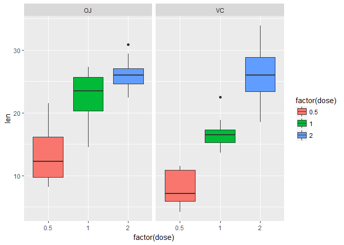

The dataset in this project desribes the effect of vitamin C on the
tooth growth in Guniea Pigs. The response is the length of odontoblasts
(cells responsible for tooth growth) in 60 guinea pigs. Each animal
received one of three dose levels of vitamin C (0.5, 1, and 2 mg/day) by
one of two delivery methods, (orange juice or ascorbic acid (a form of
vitamin C and coded as VC).

A data frame with 60 observations on 3 variables.

\[,1\] len numeric Tooth length \[,2\] supp factor Supplement type (VC
or OJ). \[,3\] dose numeric Dose in milligrams/day

    str(ToothGrowth)

    ## 'data.frame':    60 obs. of  3 variables:
    ##  $ len : num  4.2 11.5 7.3 5.8 6.4 10 11.2 11.2 5.2 7 ...
    ##  $ supp: Factor w/ 2 levels "OJ","VC": 2 2 2 2 2 2 2 2 2 2 ...
    ##  $ dose: num  0.5 0.5 0.5 0.5 0.5 0.5 0.5 0.5 0.5 0.5 ...

    summary(ToothGrowth)

    ##       len        supp         dose      
    ##  Min.   : 4.20   OJ:30   Min.   :0.500  
    ##  1st Qu.:13.07   VC:30   1st Qu.:0.500  
    ##  Median :19.25           Median :1.000  
    ##  Mean   :18.81           Mean   :1.167  
    ##  3rd Qu.:25.27           3rd Qu.:2.000  
    ##  Max.   :33.90           Max.   :2.000

    library(ggplot2)
    g<-ggplot(ToothGrowth,aes(factor(dose),len))
    g+geom_boxplot(aes(fill=factor(dose)))+facet_grid(.~supp)

Based on this plot it can be concluded that the mean of tooth growth
increases with the increase of the dose for both delivery method. This
can be verified with hypothesis testing.

### T test comparing dose level 0.5 and 1 mg/day.

This is independent group t test as the dose is applied to different
pigs.

    t1<-subset(ToothGrowth, dose %in% c(0.5,1) & supp %in% c("VC"))
    t.test(len~dose, paired = FALSE, var.equal = FALSE, data=t1)

    ## 
    ##  Welch Two Sample t-test
    ## 
    ## data:  len by dose
    ## t = -7.4634, df = 17.862, p-value = 6.811e-07
    ## alternative hypothesis: true difference in means is not equal to 0
    ## 95 percent confidence interval:
    ##  -11.265712  -6.314288
    ## sample estimates:
    ## mean in group 0.5   mean in group 1 
    ##              7.98             16.77

    t2<-subset(ToothGrowth, dose %in% c(0.5,1) & supp %in% c("OJ"))
    t.test(len~dose, paired = FALSE, var.equal = FALSE, data=t2)

    ## 
    ##  Welch Two Sample t-test
    ## 
    ## data:  len by dose
    ## t = -5.0486, df = 17.698, p-value = 8.785e-05
    ## alternative hypothesis: true difference in means is not equal to 0
    ## 95 percent confidence interval:
    ##  -13.415634  -5.524366
    ## sample estimates:
    ## mean in group 0.5   mean in group 1 
    ##             13.23             22.70

Based on the T test it can be concluded that tooth grwoth is higher when
using dose 1mg/day for both delivery method. This is also supported by
confidence intervals which do not include 0.

### T test comparing dose level 0.5 and 2 mg/day.

This is independent group t test as the dose is applied to different
pigs.

    t3<-subset(ToothGrowth, dose %in% c(0.5,2) & supp %in% c("VC"))
    t.test(len~dose, paired = FALSE, var.equal = FALSE, data=t3)

    ## 
    ##  Welch Two Sample t-test
    ## 
    ## data:  len by dose
    ## t = -10.388, df = 14.327, p-value = 4.682e-08
    ## alternative hypothesis: true difference in means is not equal to 0
    ## 95 percent confidence interval:
    ##  -21.90151 -14.41849
    ## sample estimates:
    ## mean in group 0.5   mean in group 2 
    ##              7.98             26.14

    t4<-subset(ToothGrowth, dose %in% c(0.5,2) & supp %in% c("OJ"))
    t.test(len~dose, paired = FALSE, var.equal = FALSE, data=t4)

    ## 
    ##  Welch Two Sample t-test
    ## 
    ## data:  len by dose
    ## t = -7.817, df = 14.668, p-value = 1.324e-06
    ## alternative hypothesis: true difference in means is not equal to 0
    ## 95 percent confidence interval:
    ##  -16.335241  -9.324759
    ## sample estimates:
    ## mean in group 0.5   mean in group 2 
    ##             13.23             26.06

Based on the T test it can be concluded that tooth grwoth is higher when
using dose 2mg/day for both delivery method. This is also supported by
confidence intervals which do not include 0.

### T test comparing dose level 1 and 2 mg/day.

This is independent group t test as the dose is applied to different
pigs.

    t5<-subset(ToothGrowth, dose %in% c(1,2) & supp %in% c("VC"))
    t.test(len~dose, paired = FALSE, var.equal = FALSE, data=t5)

    ## 
    ##  Welch Two Sample t-test
    ## 
    ## data:  len by dose
    ## t = -5.4698, df = 13.6, p-value = 9.156e-05
    ## alternative hypothesis: true difference in means is not equal to 0
    ## 95 percent confidence interval:
    ##  -13.054267  -5.685733
    ## sample estimates:
    ## mean in group 1 mean in group 2 
    ##           16.77           26.14

    t6<-subset(ToothGrowth, dose %in% c(1,2) & supp %in% c("OJ"))
    t.test(len~dose, paired = FALSE, var.equal = FALSE, data=t6)

    ## 
    ##  Welch Two Sample t-test
    ## 
    ## data:  len by dose
    ## t = -2.2478, df = 15.842, p-value = 0.0392
    ## alternative hypothesis: true difference in means is not equal to 0
    ## 95 percent confidence interval:
    ##  -6.5314425 -0.1885575
    ## sample estimates:
    ## mean in group 1 mean in group 2 
    ##           22.70           26.06

Based on the T test it can be concluded that tooth grwoth is higher when
using dose 2mg/day for both delivery method. This is also supported by
confidence intervals which do not include 0.

### T test comparing delivery method OJ and VC for dose 0.5 mg/day.

This is independent group t test as the dose is applied to different
pigs.

    t7<-subset(ToothGrowth, dose %in% c("0.5"))
    t.test(len~supp, paired = FALSE, var.equal = FALSE, data=t7)

    ## 
    ##  Welch Two Sample t-test
    ## 
    ## data:  len by supp
    ## t = 3.1697, df = 14.969, p-value = 0.006359
    ## alternative hypothesis: true difference in means is not equal to 0
    ## 95 percent confidence interval:
    ##  1.719057 8.780943
    ## sample estimates:
    ## mean in group OJ mean in group VC 
    ##            13.23             7.98

Based on the T test it can be concluded that tooth grwoth is higher for
OJ delivery method using dose 0.5mg/day and the probability that the
null hypothesis (the toothe growth is similar) is only 5%. This is also
supported by confidence intervals which do not include 0.

### T test comparing delivery method OJ and VC for dose 1 mg/day.

This is independent group t test as the dose is applied to different
pigs.

    t8<-subset(ToothGrowth, dose %in% c("1"))
    t.test(len~supp, paired = FALSE, var.equal = FALSE, data=t8)

    ## 
    ##  Welch Two Sample t-test
    ## 
    ## data:  len by supp
    ## t = 4.0328, df = 15.358, p-value = 0.001038
    ## alternative hypothesis: true difference in means is not equal to 0
    ## 95 percent confidence interval:
    ##  2.802148 9.057852
    ## sample estimates:
    ## mean in group OJ mean in group VC 
    ##            22.70            16.77

Based on the T test it can be concluded that tooth grwoth is higher for
OJ delivery method using dose 1 mg/day and the probability that the null
hypothesis (the toothe growth is similar) is only 5%. This is also
supported by confidence intervals which do not include 0.

### T test comparing delivery method OJ and VC for dose 2 mg/day.

This is independent group t test as the dose is applied to different
pigs.

    t9<-subset(ToothGrowth, dose %in% c("2"))
    t.test(len~supp, paired = FALSE, var.equal = FALSE, data=t9)$conf

    ## [1] -3.79807  3.63807
    ## attr(,"conf.level")
    ## [1] 0.95

    t.test(len~supp, paired = FALSE, var.equal = FALSE, data=t9)$p.value

    ## [1] 0.9638516

The confidance interval does include 0. Therefore, average two growth
with OJ and VC delivery method using 2 mg/day dose may not have any
difference. The high p value also supports the similarity in average
toorh growth with both delivery method when the dose is 2 mg/day.
