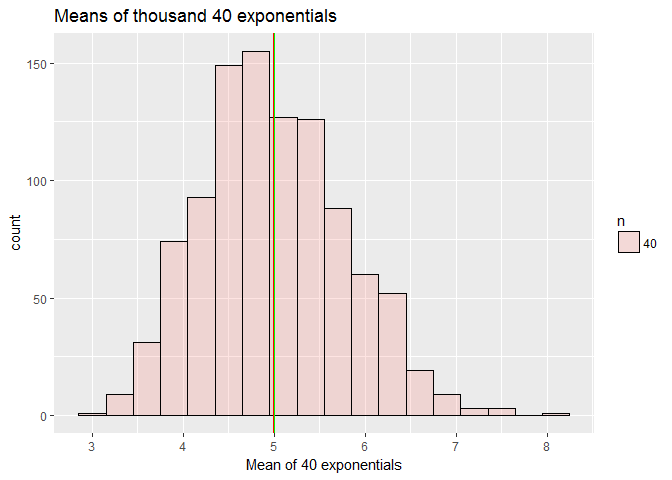
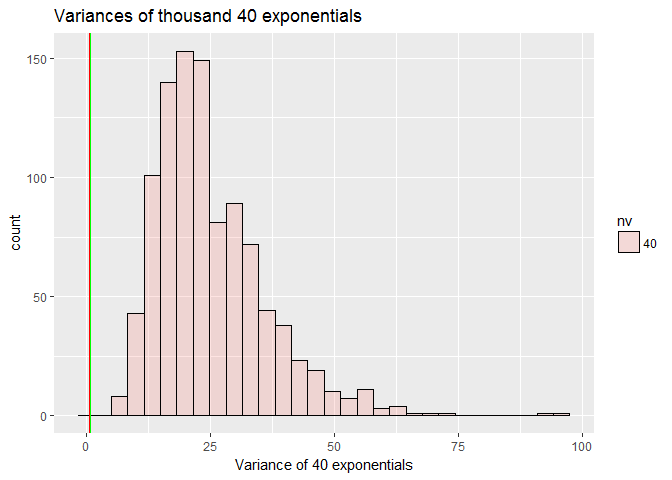
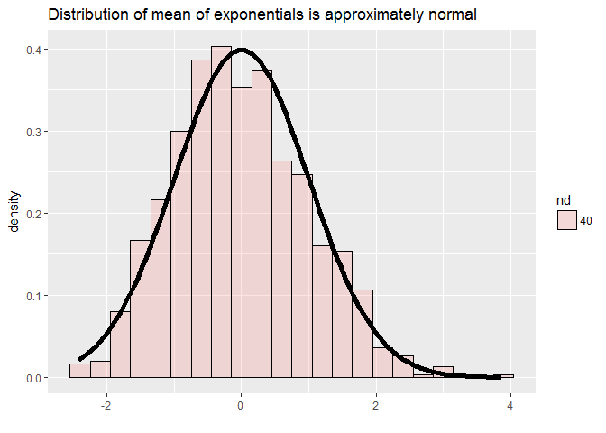

In this part of the project, exponential distribution in R will be
simulated and compare with the Central Limit Theorem. The report will
show that the distribution of averages of IID variables is a standard
normal distributin folloiwng central limit theorem provided that sample
size is large.

### Simulation and mean

    set.seed(1)
    nosim<-1000
    dat <- data.frame(
      x = apply(matrix(rexp(nosim * 40,rate=0.2), nosim),1,mean),
      n = factor(rep(c("40"),c(nosim))) 
    )

nosim is the number of simulation as instructed in the problem. Using
rexp an exponential distribution has been created. Then mean is
calculated and put into x. A data frame is created to use ggplot for
plotting

    library(ggplot2)
    g <- ggplot(dat, aes(x = x, fill = n))
    g<-g+geom_histogram(alpha = .20, binwidth=.3, colour = "black")
    g<-g+geom_vline(aes(xintercept = mean(dat$x)),colour="red")+geom_vline(xintercept = 5,colour="green")
    g<-g+labs(x="Mean of 40 exponentials", title="Means of thousand 40 exponentials")
    print(g)

Histogram of means of thousdand 40 exponentials is shown. Two vertical
lines are drawn, one showing the sample mean in red and the green
vertical is the theoritical mean which is 1/lamda=5. The sample mean

    mean(dat$x)

    ## [1] 4.990025

is very close to theoritical mean.

### Simulation and variance

    set.seed(1)
    nosim<-1000
    datv <- data.frame(
      xv = apply(matrix(rexp(nosim * 40,rate=0.2), nosim),1,var),
      nv = factor(rep(c("40"),c(nosim))) 
    )

nosim is the number of simulation as instructed in the problem. Using
rexp an exponential distribution has been created. Then variance is
calculated and put into x. A data frame is created to use ggplot for
plotting

    library(ggplot2)
    g <- ggplot(datv, aes(x = xv, fill = nv))
    g<-g+geom_histogram(alpha = .20, colour = "black")
    g<-g+geom_vline(aes(xintercept = var(dat$x)),colour="red")+geom_vline(xintercept = 0.625,colour="green")
    g<-g+labs(x="Variance of 40 exponentials", title="Variances of thousand 40 exponentials")
    print(g)

    ## `stat_bin()` using `bins = 30`. Pick better value with `binwidth`.

Histogram of variances of thousdand 40 exponentials is shown. Two
vertical lines are drawn, one showing the sample variance in red and the
green vertical is the theoritical variance which is

    lamda<-0.2
    v<-(1/lamda)^2
    sv<-v/40
    sv

    ## [1] 0.625

The sample variance

    var(dat$x)

    ## [1] 0.6177072

is very close to theoritical variance.

### Distribution

    set.seed(1)
    nosim<-1000
    cfunc <- function(x, n) sqrt(n) * (mean(x) - 5) / 5
    datd <- data.frame(
      xd = apply(matrix(rexp(nosim * 40,rate=0.2), nosim),1,cfunc,40),
      nd = factor(rep(c("40"),c(nosim))) 
    )

    library(ggplot2)
    g <- ggplot(datd, aes(x = xd, fill = nd))
    g<-g+geom_histogram(alpha = .20, binwidth=0.3,colour = "black",aes(y=..density..))
    g<-g+stat_function(fun = dnorm, size=2)
    g<-g+labs(x="", title="Distribution of mean of exponentials is approximately normal")
    print(g)

The distribution of mean of exponentials is transformed to standard
normal by CLT. The resulting distribution close follows normal
distribution as illustrate in the figure
