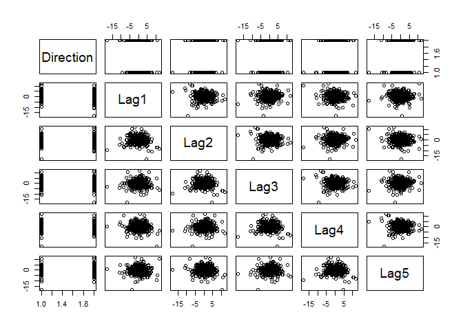

    library(ISLR)
    attach(Weekly)
    dim(Weekly)

    ## [1] 1089    9

    head(Weekly)

    ##   Year   Lag1   Lag2   Lag3   Lag4   Lag5    Volume  Today Direction
    ## 1 1990  0.816  1.572 -3.936 -0.229 -3.484 0.1549760 -0.270      Down
    ## 2 1990 -0.270  0.816  1.572 -3.936 -0.229 0.1485740 -2.576      Down
    ## 3 1990 -2.576 -0.270  0.816  1.572 -3.936 0.1598375  3.514        Up
    ## 4 1990  3.514 -2.576 -0.270  0.816  1.572 0.1616300  0.712        Up
    ## 5 1990  0.712  3.514 -2.576 -0.270  0.816 0.1537280  1.178        Up
    ## 6 1990  1.178  0.712  3.514 -2.576 -0.270 0.1544440 -1.372      Down

    pairs(Direction~Lag1+Lag2+Lag3+Lag4+Lag5)

Perform Logistic regression with Direction as the response and the five
lag cariables plus Volume as predictors.

    glm.fit<-glm(Direction~Lag1+Lag2+Lag3+Lag4+Lag5+Volume,data=Weekly,family=binomial)
    summary(glm.fit)

    ## 
    ## Call:
    ## glm(formula = Direction ~ Lag1 + Lag2 + Lag3 + Lag4 + Lag5 + 
    ##     Volume, family = binomial, data = Weekly)
    ## 
    ## Deviance Residuals: 
    ##     Min       1Q   Median       3Q      Max  
    ## -1.6949  -1.2565   0.9913   1.0849   1.4579  
    ## 
    ## Coefficients:
    ##             Estimate Std. Error z value Pr(>|z|)   
    ## (Intercept)  0.26686    0.08593   3.106   0.0019 **
    ## Lag1        -0.04127    0.02641  -1.563   0.1181   
    ## Lag2         0.05844    0.02686   2.175   0.0296 * 
    ## Lag3        -0.01606    0.02666  -0.602   0.5469   
    ## Lag4        -0.02779    0.02646  -1.050   0.2937   
    ## Lag5        -0.01447    0.02638  -0.549   0.5833   
    ## Volume      -0.02274    0.03690  -0.616   0.5377   
    ## ---
    ## Signif. codes:  0 '***' 0.001 '**' 0.01 '*' 0.05 '.' 0.1 ' ' 1
    ## 
    ## (Dispersion parameter for binomial family taken to be 1)
    ## 
    ##     Null deviance: 1496.2  on 1088  degrees of freedom
    ## Residual deviance: 1486.4  on 1082  degrees of freedom
    ## AIC: 1500.4
    ## 
    ## Number of Fisher Scoring iterations: 4

Only lag2 seems to be Statistically significant. Now confusion matrix
will be formed.

    glm.probs<-predict(glm.fit,type="response")
    glm.pred=rep("Down",1089)
    glm.pred[glm.probs>0.5]="Up"
    table(glm.pred,Direction)

    ##         Direction
    ## glm.pred Down  Up
    ##     Down   54  48
    ##     Up    430 557

    mean(glm.pred==Direction)

    ## [1] 0.5610652

The prediction error of logictic regression is about 46%.

Now a logistic regression will be fitted using a training data period
from 1990 to 2008 with Lag2 as the only predictor. This model will be
used to predict Direction for 2009 to 2010 data.

    y.train<-Year<2009
    D.train<-Weekly[y.train,]
    head(D.train)

    ##   Year   Lag1   Lag2   Lag3   Lag4   Lag5    Volume  Today Direction
    ## 1 1990  0.816  1.572 -3.936 -0.229 -3.484 0.1549760 -0.270      Down
    ## 2 1990 -0.270  0.816  1.572 -3.936 -0.229 0.1485740 -2.576      Down
    ## 3 1990 -2.576 -0.270  0.816  1.572 -3.936 0.1598375  3.514        Up
    ## 4 1990  3.514 -2.576 -0.270  0.816  1.572 0.1616300  0.712        Up
    ## 5 1990  0.712  3.514 -2.576 -0.270  0.816 0.1537280  1.178        Up
    ## 6 1990  1.178  0.712  3.514 -2.576 -0.270 0.1544440 -1.372      Down

    D.test<-subset(Weekly, Year %in% c(2009,2010))
    head(D.test)

    ##     Year   Lag1   Lag2   Lag3   Lag4   Lag5   Volume  Today Direction
    ## 986 2009  6.760 -1.698  0.926  0.418 -2.251 3.793110 -4.448      Down
    ## 987 2009 -4.448  6.760 -1.698  0.926  0.418 5.043904 -4.518      Down
    ## 988 2009 -4.518 -4.448  6.760 -1.698  0.926 5.948758 -2.137      Down
    ## 989 2009 -2.137 -4.518 -4.448  6.760 -1.698 6.129763 -0.730      Down
    ## 990 2009 -0.730 -2.137 -4.518 -4.448  6.760 5.602004  5.173        Up
    ## 991 2009  5.173 -0.730 -2.137 -4.518 -4.448 6.217632 -4.808      Down

    glm.fit2<-glm(Direction~Lag2,data=D.train,family=binomial)
    glm.probs2<-predict(glm.fit2,D.test,type="response")
    dim(D.test)

    ## [1] 104   9

    glm.pred2=rep("Down",104)
    glm.pred2[glm.probs2>0.5]="Up"
    table(glm.pred2,D.test$Direction)

    ##          
    ## glm.pred2 Down Up
    ##      Down    9  5
    ##      Up     34 56

    mean(glm.pred2==D.test$Direction)

    ## [1] 0.625

Now we will use LDA

    library(MASS)
    lda.fit<-lda(Direction~Lag2,data=D.train)
    lda.pred<-predict(lda.fit,D.test,type="response")
    names(lda.pred)

    ## [1] "class"     "posterior" "x"

    table(lda.pred$class,D.test$Direction)

    ##       
    ##        Down Up
    ##   Down    9  5
    ##   Up     34 56

    mean(lda.pred$class==D.test$Direction)

    ## [1] 0.625

Now we will use QDA

    qda.fit<-qda(Direction~Lag2,data=D.train)
    qda.pred<-predict(qda.fit,D.test,type="response")
    names(qda.pred)

    ## [1] "class"     "posterior"

    table(qda.pred$class,D.test$Direction)

    ##       
    ##        Down Up
    ##   Down    0  0
    ##   Up     43 61

    mean(qda.pred$class==D.test$Direction)

    ## [1] 0.5865385

Now we will use KNN

    library(class)
    D.Direction=Direction[y.train]
    head(D.Direction,20)

    ##  [1] Down Down Up   Up   Up   Down Up   Up   Up   Down Down Up   Up   Up  
    ## [15] Down Up   Down Up   Down Up  
    ## Levels: Down Up

    train.X=as.matrix(Lag2[y.train])
    dim(train.X)

    ## [1] 985   1

    test.X=as.matrix(Lag2[!y.train])
    dim(test.X)

    ## [1] 104   1

    set.seed(1)
    knn.pred=knn(train.X,test.X,D.Direction,k=1)
    table(knn.pred,D.test$Direction)

    ##         
    ## knn.pred Down Up
    ##     Down   21 30
    ##     Up     22 31

    mean(knn.pred==D.test$Direction)

    ## [1] 0.5

Therefore, LDA and Logistic regression provide best results on this data

\`\`\`
